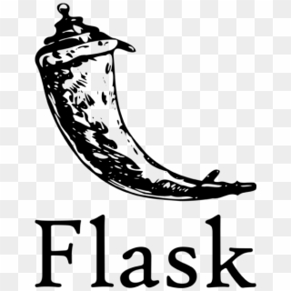

{ style="display:block; margin:0 auto"}

# Flask tutorials
## Wath is Flask
Flask is a lightweight Python web framework that allows you to build web applications quickly and efficiently. It's a popular choice for developers who prefer a minimalist approach and want to have more control over their application's architecture.
### Install Flask

```
pip install flask
```
### Minimal flask application
In a file named app.py add th flowing code:

```python
from flask import Flask

app = Flask(__name__)

@app.route('/')
def index():
    return '<h1>Hello World</h1>'

if __name__ == '__main__':
    app.run(debug=True)

```
### Templates flask
add a folder with the name __templates__
in the route view use the __render_template__ kew word after importing it
```python
from flask import Flask, render_template

app = Flask(__name__)

@app.route('/')
def index():
    return render_template('index.html')

if __name__ == '__main__':
    app.run(debug=True)

```